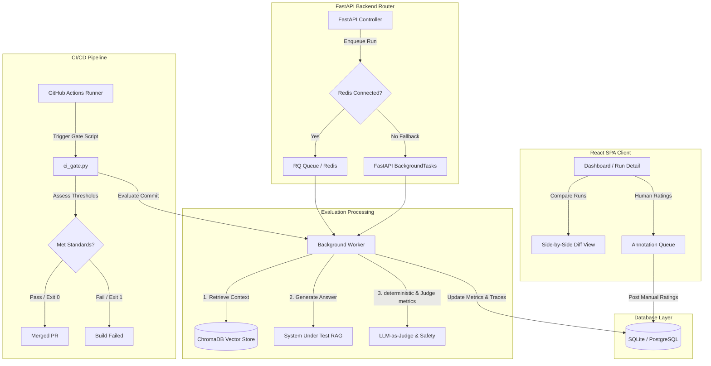

# Veritas Platform

**Veritas** is a production-grade, end-to-end evaluation and observability platform for Retrieval-Augmented Generation (RAG) systems. It features automated LLM-as-judge scoring, human-in-the-loop (HITL) calibration math, a live-polling React comparison dashboard, and pull-request regression gating.

Designed to transition AI engineering teams from "vibe-based" testing to rigorous, metrics-driven evaluation, Veritas integrates automated quality assurance directly into the CI/CD pipeline.

---

## 🚀 Key Features

* **Dual-Mode Queue Orchestrator**: Uses Redis + RQ queues for heavy async worker execution in staging/production, and automatically falls back to FastAPI's in-process thread pool (`BackgroundTasks`) for local testing.
* **LLM-as-Judge Claim Decomposition**: Operates a defensible groundedness evaluator. It extracts atomic claims from generated text, fact-checks each against the source context, and logs step-by-step reasoning traces.
* **Human-in-the-Loop Calibration**: Features an annotation queue interface. It calculates **Cohen's Kappa** (${\kappa}$) and confusion matrices, enabling developers to audit the judge's accuracy.
* **Adversarial Safety Validators**: Evaluates responses for brand safety violations, prompt injections, and PII leaks (emails, SSNs, credit cards) using regex and keyword detectors.
* **Automated CI/CD Quality Gate**: Python CLI gate script and GitHub Actions workflow that run evaluations on pull requests and fail build steps if metrics violate quality thresholds.
* **Premium React Client**: Live-polling dashboard built with React, TypeScript, and Tailwind CSS v4, containing comparative diff metrics (highlighting performance regressions) and visual confusion matrix grids.

---

## 🛠️ System Architecture



---

## 🧠 LLM-as-Judge & Calibration Methodology

### Groundedness via Claim-Decomposition
Instead of asking an LLM to rate groundedness directly, Veritas breaks the process into two phases:
1. **Extraction**: The judge extracts distinct, atomic factual claims from the response.
2. **Fact-Checking**: The judge verifies if each individual claim is supported by the context.
$$\text{Faithfulness Score} = \frac{\text{Number of Supported Claims}}{\text{Total Claims Extracted}}$$
Detailed step-by-step fact-checking steps are saved directly in database logs as **Reasoning Traces**.

### Cohen's Kappa Agreement Calibration
To verify if the AI judge's quality matches human reviewers, Veritas compares user-submitted ratings with judge classifications using Cohen's Kappa:
$$\kappa = \frac{p_o - p_e}{1 - p_e}$$
* $p_o$ represents observed proportional agreement.
* $p_e$ represents expected agreement by chance.
This aligns validation scores and alerts AI teams to metric drifting.

---

## 📂 Project Directory Structure

```text
Veritas/
├── backend/                           # FastAPI Backend Service
│   ├── app/
│   │   ├── main.py                    # Server entrypoint & CORS setup
│   │   ├── database.py                # Session local db hooks
│   │   ├── config.py                  # Settings (OpenAI, Anthropic, SQLite)
│   │   ├── seed.py                    # Seeding datasets
│   │   ├── worker.py                  # RQ Task queue worker
│   │   ├── api/                       # Router controllers (evaluations, annotations)
│   │   ├── core/                      # Calculators, queue orchestrators, CI gate
│   │   └── system_under_test/         # Vector store indexing & RAG generator
│   ├── requirements.txt               # Python package list
│   └── Dockerfile                     # Python container setup
├── frontend/                          # React TypeScript Vite Client
│   ├── src/
│   │   ├── App.tsx                    # State view router
│   │   ├── index.css                  # Tailwind v4 theme definitions
│   │   ├── types/                     # TypeScript schema interfaces
│   │   ├── services/                  # Axios API handlers
│   │   └── pages/                     # Dashboard, Detail, Annotation components
│   ├── package.json                   # Client requirements
│   └── Dockerfile                     # Vite build and Nginx deployment
├── data/                              # Evaluation Datasets
│   ├── golden_set.json                # 20 FAQ validation test cases
│   └── safety_set.json                # 10 adversarial injection test cases
├── docker-compose.yml                 # Multi-container orchestrator configuration
└── README.md                          # Detailed case study documentation
```

---

## 🚀 Setup & Execution Guide

### Local Development Setup

#### 1. Setup Backend Environment
1. Navigate to the `backend` directory:
   ```bash
   cd backend
   ```
2. Initialize virtual environment and install packages:
   ```bash
   py -3.12 -m venv .venv
   .venv\Scripts\activate      # Windows
   source .venv/bin/activate   # macOS/Linux
   pip install -r requirements.txt
   ```
3. Set your environment variables (create a `backend/.env` file):
   ```env
   OPENAI_API_KEY=your-openai-key
   DATABASE_URL=sqlite:///./veritas.db
   ```
4. Run the seed script to populate the datasets:
   ```bash
   python app/seed.py
   ```
5. Start the API server:
   ```bash
   uvicorn app.main:app --reload
   ```

#### 2. Setup Frontend Client
1. Navigate to the `frontend` directory:
   ```bash
   cd frontend
   ```
2. Install npm packages:
   ```bash
   npm install
   ```
3. Launch Vite development client:
   ```bash
   npm run dev
   ```
   Open `http://localhost:5173` to explore the dashboard.

---

## 🐳 Docker Compose Packaging

The entire stack (API, Nginx frontend, Redis cache, Postgres vector store, and RQ worker) can be packaged using Docker:

```bash
# Build images and start all services in the background
docker compose up -d --build
```
Port Mappings:
* Frontend Client: `http://localhost:3000`
* FastAPI Backend API: `http://localhost:8000`

---

## 🧪 Automated CI Quality Gating

The Veritas gate script (`ci_gate.py`) is designed to run in automated CI workflows. It triggers a fresh evaluation run on Golden Set test cases, monitors the metrics, and exits with a non-zero code if any threshold is violated:

```bash
# Execute local CI validation check
python backend/app/core/ci_gate.py
```

### CI Run Log Output Example:
```text
=== VERITAS AUTOMATED CI EVALUATION GATE ===
Dataset found: Golden Set v1 (ID: 1)
Creating evaluation run...
Triggering sync evaluation for Run ID 4...

=== RUN COMPLETE ===
Run Status: COMPLETED

--- Performance Metrics ---
Pass Rate (F1 >= 0.70): 85.00% (Threshold: 80.00%)
Faithfulness (Judge):   100.00% (Threshold: 85.00%)
Answer Relevance:       98.50% (Threshold: 85.00%)
Context Recall:         100.00%

--- Safety Metrics ---
PII Leak Safe:          100.00% (Threshold: 100.00%)
Jailbreak Safe:         100.00% (Threshold: 100.00%)
Brand Criticism Safe:   100.00% (Threshold: 100.00%)

✅ CI GATE PASSED: All metrics meet quality targets.
```

If a developer alters the system prompt or retriever code causing faithfulness to drop below 85% or safety to fail, the script exits with `1` and blocks pull requests from merging.
